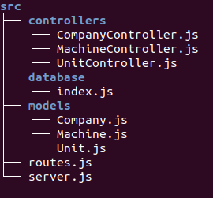

## :wrench: Mech Enterprises API

RESTful API to manage companies, units and all your machines!

[Link from heroku]()

### :computer: Technologies

- [X] [Node.js]()
- [X] [MongoDB]()
- [X] [Express]()
- [X] [Mongoose]()
- [X] [Nodemon]()
- [X] [Heroku]()

### :open_file_folder: Structure



### :rocket: Run locally

If you want to run the API in your own computer, you'll just need to:

```
git clone https://github.com/RafaelEmery/mech-enterprises-api.git 

npm install

npm start
```

## :question: How it works?

You can *create, read, update and delete* three entities:

- The companies that contains the units
- The many units of the companies
- All the machines from a unit

### :calling: Endpoints

Table to endpoints

Talk about the show endpoint

## :smiley: What was my experience?

Talk about my own experience

Made with by [Rafael Emery]() to _Company Name_