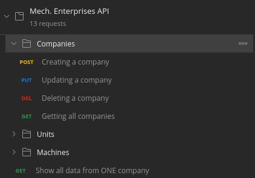

## :wrench: Mech Enterprises API

RESTful API to manage companies, units and all your machines!

[https://mech-enterprises-api.herokuapp.com/](https://mech-enterprises-api.herokuapp.com/)

### :computer: Technologies

- [X] [Node.js](https://nodejs.org/en/)
- [X] [MongoDB Atlas](https://www.mongodb.com/cloud/atlas)
- [X] [Express](https://expressjs.com/pt-br/)
- [X] [Mongoose](https://mongoosejs.com/)
- [X] [Nodemon](https://nodemon.io/)(Development only)
- [X] [Postman](https://www.postman.com/)
- [X] [Heroku](https://www.heroku.com/)

### :open_file_folder: Structure and Postman Collecion




### :rocket: Run locally

If you want to run the API in your own computer, you'll just need to:

```
git clone https://github.com/RafaelEmery/mech-enterprises-api.git 

npm install

npm start
```

## :question: How it works?

You can *create, read, update and delete* three entities:

- The companies that contains the units
- The many units of the companies
- All the machines from a unit

### :calling: Endpoints

| Routes | Methods | Params |
| -------|---------|--------|
| /companies| GET, POST, PUT, DELETE | :id on PUT, DELETE and *show* function |
| /units| GET, POST, PUT, DELETE | :id on PUT and DELETE |
| /machines| GET, POST, PUT, DELETE | :id on PUT and DELETE |

*Important*: If you want to get all data from a single company (all units and all machines) in a single GET request, you'll have to use the */companies/:id* endpoint.

### :nut_and_bolt: Example of POST requests

```
Creating a machine
{   
    "unit": "5f4937494ab3c8782ed3b2a3", //Unit id
    "name": "Machine 1",
    "image": "http://image.com", //Image url
    "model": "Model 1",
    "responsible": "Rafa",
    "status": "Available" //Enum of ['Available', 'Disable', 'In maintence']
}

Return
{
    "message": "Machine created!"
}
```

## :smiley: What was my experience?

Once i used MongoDB Atlas and Mongoose while i was watching a YouTube tutorial, but i didn't really learned a lot about it. This times, i consider it a great experience to code with different/unusual (for myself) techniques, packages (ODM) and Data Bases.

MongoDB surely is a great option to use with Node.js and Mongoose is a very nice ODM, with a great documentation. However, i struggled to work with assiociations using NoSQL. 

Made with by [Rafael Emery](https://rafaelemery.github.io) to Tractian. Hope you enjoy it!